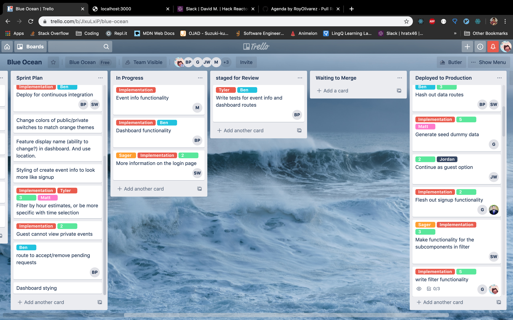

## Wevent

*Wevent* is a responsive web application that allows users to view events on a calendar  based on a set location. Users can search for events by applying  filters based on their location (city, state), category type, number of attendees, private / public , or the cost of an event. Users can choose whether or not to attend and event or just as easily create a new event with similar filters

## Contributors

[Sager Williams](https://github.com/SagerWilliams)

[Jordan Worm](https://github.com/jtworm96)

[Tyler Rhodes](https://github.com/tylerCaineRhodes)

[Ben Pernick](https://github.com/bpernick)

[Matt Gittleman](https://github.com/mgittle)

[Roy Olivarez](https://github.com/RoyOlivarez)

[Mark Wallace](https://github.com/mwallace999)

## Tech Stack

*Wevent* was built primarily with ReactJS on the front-end and Node/Express on the backend. Other key technologies used are listed below:

<table>
  <tr>
  </tr>
  <tr>
    <td align="center">Front-end</td>
    <td align="center">Back-end</td>
    <td align="center">Deployment</td>
    <td align="center">APIs</td>
    <td align="center">Testing</td>
  </tr>
  <tr>
    <td align="center"></td>
    <td align="center"></td>
    <td align="center"></td>
    <td align="center"></td>
    <td align="center"></td>
  </tr>  
  <tr>
    <td align="center"></td>
    <td align="center"></td>
    <td align="center"></td>
    <td align="center"></td>
    <td align="center"></td>
  </tr>
  <tr>
    <td align="center"></td>
    <td align="center"></td>
    <td align="center"></td>
    <td align="center"></td>
    <td align="center"></td>
  </tr>
  <tr>
    <td align="center"></td>
    <td align="center"></td>
    <td align="center"></td>
    <td align="center"></td>
    <td align="center"></td>
  </tr>
</table>

## Technical Challenges / Research

 - Why, what was the plan to overcome those challenges
 - What did you learn

## Unexpected Challenges
 - What were the user stories / what was MVP (mention Minimal Viable Product)

## Client Deliverables 

Our team developed the following user stories to track deliverables and meet the expectations of our client

## User Stories

Login / Signup
 - Users can login with username and password.
 - User signs up with a display name, password, city, and state.

Filter
 - Users can filter events by category.
 - Users can filter events by distance.
 - Users can filter events by # of people. 
 - Users can filter events by cost.
 - Users can filter events by a keyword. 
 - Users can filter events by duration.
 - Users can filter events by the time of day.
 - Users can filter events by private/public.
 - Users can filter events by the event location.
 - Users can filter events by open/closed status.

Dashboard
 - Users can view events by hosting / attending status. View in a list format.
 - Users location is displayed.
 - Users can click on an event in the list and link to event info.
 - Users should be able to view the dashboard button.

Create Event
 - Users can access a form to create a new event.
 - When a user submits a new event, that event appears on the calendar.
 - Users can click on an event in the list and link to event info.
 - User inputs are Name, Date, location, price, time, duration, description, category private/public, max people.

Calendar
 - Users logs in and sees a month calendar of displayed events by location(lat/long)
 - Users can change the display of the calendar by month, week or day.
 - Calendar displays events based on filter
 - User can filter events by category, distance, # of people, cost, keyword, duration/time, private/public event

## Minimum Viable Product (MVP)
This MVP was completed under a strict time constraint- six days from the initial meeting with our client. This required us to seriously prioritize efficiency and core functionality over other superfluous features. 

## How the app works

What happens behind the scenes when the user interacts with it? 
OR What are all the place the data travels?  What happens to that data?
Optionally include a diagram
How does the tech stack come together?

// NEED TO ADD VIDEO OF APPLICATION

// NEED TO ADD SCHEMA IMAGE

### Development Workflow
Our team managed workflow and responsibilities by utilizing Agile methodology. [Trello](https://trello.com/b/JIxuLxiP/blue-ocean) was used to to keep track of tickets. All development work was specifically associated with a ticket. At any point in time the status of a ticket could be ascertained by finding it on the board. After our daily standup meeting we assessed the status of our application then updated and reassigned tickets based on workload.

## Version Control and Continuous Integration

Our team utilized git feature branch workflow to ensure our master branch always contained working code. Our master and development branches blocked direct pushes of new code. Instead, developers would create feature branches off the development branch, then create pull requests into development upon completion of that feature.
All pull requests required review by another developer prior to merging new features into development. Our team utilized Travis CI for continuous integration. We integrated Travis with GitHub, allowing reviewers to easily ensure the branch they were reviewing had passed our testing suite. Pull requests with failed tests were barred from merging, and required the developer who opened the request to resolve the issue. The development branch was only merged into master after significant testing and approval by the entire team. This ensured our deployed build was never broken.

## Workflow and Key lessons from your team - specifically those related to: Agile, CI/CD, testing, working with external stakeholders, ticketing, and user stories.

Your git workflow, style guides, commit guides, etc
What did you learn from the process
What were key takeaways from stand ups, code reviews, etc
Writing tests
Link to your trello board, discuss completed tickets

## What additional features do you plan to add, how do you plan to implement those features?
As an app scales and complexity increases, localizing state becomes an even greater priority. This can be alleviated by using Redux/a central store to keep state seperate from the components, and Wevent is already at a size which is begging for a refactor. 

Additional dev ops considerations?
UI/UX additions?

